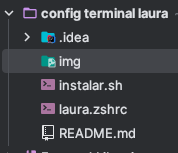
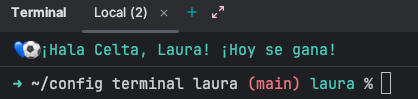

# 💙⚽ Configuración Terminal Celtista de Laura
Esta configuración transforma tu terminal en una experiencia visual y motivadora con los colores del RC Celta, usando Oh My Zsh y un prompt totalmente personalizado.

🚀 Características principales

• Prompt en azul celeste, blanco y rojo fuego

• Integración con Oh My Zsh

• Mensaje motivador al iniciar la terminal

• Script de instalación automática

• Archivo .zshrc personalizado con:

◦ Tema propio

◦ Plugin git

◦ Prompt con rama actual en rojo

◦ Mensaje de bienvenida celtista

◦ Integración con conda/micromamba

---

📦 Estructura del proyecto

🛠 Manual técnico
1. Oh My Zsh
   La configuración se basa en Oh My Zsh, por lo que es necesario tenerlo instalado previamente.

   El archivo laura.zshrc:

   • Define el directorio de Oh My Zsh

   • Activa el plugin git

   • Carga colores ANSI

   • Implementa una función git_prompt_info para mostrar la rama actual

   • Construye un prompt con:

   ◦ Flecha ➜ en azul celeste

   ◦ Ruta actual en blanco

   ◦ Rama git en rojo

   ◦ Firma “laura” en azul celeste

2. Mensaje motivador
   Al iniciar la terminal se imprime:

   💙⚽ ¡Hala Celta, Laura! ¡Hoy se gana!

3. Integración con conda/micromamba

   El archivo incluye el bloque generado por conda init para activar entornos automáticamente.

4. Script de instalación

instalar.sh realiza:

       1. Copia del archivo laura.zshrc a ~/.zshrc
       2. Recarga automática de la configuración
       3. Mensaje final de confirmación

---
## ⚡ Instalación rápida
1. git clone [https://github.com/lauri1604/config-terminal-laura.git)
2. cd ConfigTerminal
3. ./instalar.sh
---
## 🎨 Paleta de colores recomendada

| Color        | Código HEX |
|--------------|------------|
| Azul celeste | `#00BCD4`  |
| Rojo fuego   | `#FF2400`  |
| Blanco puro  | `#FFFFFF`  |
-- - -

## 💙 Resultado final
Una terminal limpia, moderna, funcional y con un toque celtista que te acompaña en cada sesión.

